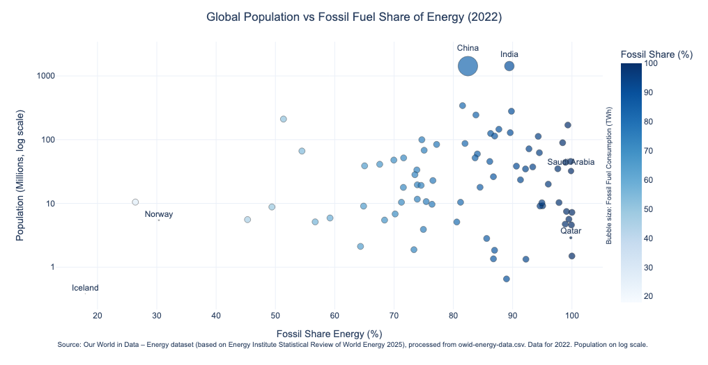
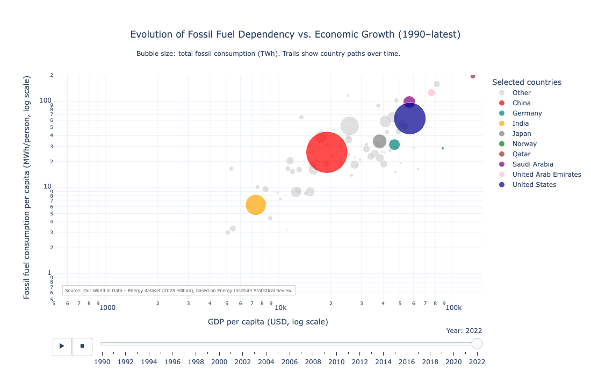

# Fossil Fuel Dependency and Economic Growth 🌍

This repository presents a data-driven analytical project examining how fossil fuel dependence relates to population scale and economic development across countries, combining interactive visualizations with a written analytical report.

The project investigates whether economic growth is associated with reductions in fossil fuel use, and to what extent observed patterns support or challenge claims of automatic decoupling between income growth and fossil energy consumption. The analysis is intended to inform energy transition and decarbonization policy discussions, particularly in high-income and energy-exporting economies.

# Research Questions #

The project is structured around three core questions:

How does population scale interact with energy mix structure to shape total fossil fuel consumption?

Does economic growth lead to lower fossil fuel use per capita at higher income levels?

What role do structural energy system characteristics and policy choices play relative to income effects?

# Data and Scope #

For cross-sectional comparisons, 2022 is used as the reference year, as it is the most recent year with broadly complete and comparable coverage across countries in the 2025 edition of the dataset. This choice avoids distortions from missing observations in later years and ensures consistency for countries with heterogeneous reporting practices. The analysis uses harmonized national energy and economic data from the Our World in Data Energy dataset, based on the Energy Institute Statistical Review of World Energy (2025). The focus is on long-run structural patterns rather than short-term fluctuations.

## Included Visualizations

1. **📊 Figure 1 Population, Fossil Fuel Share, and Total Fossil Consumption (2022)** 

This visualization examines whether population size explains fossil fuel dependence across countries, and how absolute fossil fuel consumption emerges from the interaction between population scale and energy mix structure.

Design

X-axis: Fossil fuel share of primary energy (%)

Y-axis: Population (millions, logarithmic scale)

Bubble size: Total fossil fuel consumption (primary energy, TWh)

Data year: 2022

Key insight
Population size alone does not explain fossil fuel dependence. Countries of vastly different population scales cluster across similar fossil fuel shares. However, absolute fossil fuel consumption is strongly driven by the combination of large population and high fossil fuel dependence, explaining why a small number of large economies dominate global fossil energy use.

Highlighted cases include China, India, the United States, Gulf states, and Norway.

Data source:
Our World in Data – Energy dataset, based on the Energy Institute Statistical Review of World Energy (2025).
Processed from owid-energy-data.csv.

2. **📊 Figure 2 Economic Growth and Fossil Fuel Consumption Trajectories (1990–latest)** 

This figure explores how fossil fuel consumption per capita evolves with economic growth over time and assesses whether higher income levels are associated with declining fossil energy use.

Design

X-axis: GDP per capita (USD, log scale)

Y-axis: Fossil fuel consumption per capita (MWh/person, log scale)

Bubble size: Total fossil fuel consumption (primary energy, TWh)

Time dimension: Annual data from 1990 to the latest available year (animated)

Highlighted countries: China, India, United States, Norway, Saudi Arabia, Qatar, UAE, Germany, Japan

Key insight
The animated trajectories show that economic growth is generally associated with rising fossil energy use per capita during industrialization phases. At higher income levels, fossil consumption per capita tends to plateau rather than decline, providing limited evidence of automatic decoupling between income growth and fossil energy use.

Analytically informative outliers include:

Hydro- and geothermal-rich economies (e.g., Norway), which achieve high income with relatively moderate fossil use.

Energy-exporting economies (e.g., Qatar, Saudi Arabia, UAE), characterized by extremely high per-capita fossil consumption.

Large emerging economies (e.g., China, India), where scale, industrial structure, and energy access expansion dominate trajectories.

Overall, the figure highlights that structural energy system characteristics and policy choices matter more than income alone in shaping fossil fuel dependence, with important implications for global decarbonization pathways.

Data source: Our World in Data – Energy dataset (2025 edition), based on the Energy Institute Statistical Review of World Energy. Processed from Owid_energy_data_master.csv.

## View Interactive Chart

Interactive version of Figure 2:
👉 [Open Figure 2 Interactive Chart](https://catalinaolmosd.github.io/Fossil-gdp-decoupling-viz/Figure2_interactive.html)

## Written Report

A complementary written report expands on the visual analysis and develops:

A conceptual framework distinguishing relative and absolute decoupling

Methodological choices and limitations

Policy implications for high-income and energy-exporting economies

Discussion of transition risks and structural constraints

📄 See /report/Fossil_GDP_Decoupling_Report.md
